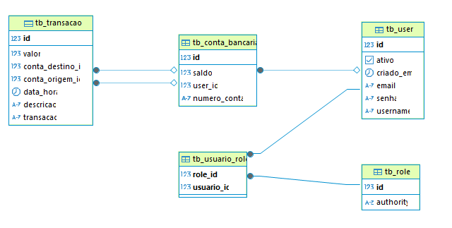

# 🏦 Banco Azimov

Sistema de backend bancário desenvolvido com **Spring Boot** e autenticação via **OAuth2 personalizada**. Permite o gerenciamento de contas bancárias, usuários e transações financeiras, com controle de acesso por perfis (usuário e administrador).

## 🚀 Tecnologias Utilizadas

- Java 21
- Spring Boot
- Spring Security (com OAuth2 custom grant)
- JPA / Hibernate
- PostgreSQL
- Maven
- ModelMapper
- Validation

## 📦 Funcionalidades

### Usuário Comum
- Criar e manipular contas bancárias
- Realizar transferências
- Consultar saldo e extrato
- Alterar senha

### Administrador
- Gerenciar usuários
- Listar e alterar contas
- Auditar transações

## 🔐 Segurança

- Autenticação via OAuth2 
- Perfis com controle de acesso (Admin/User)
- Password encoder (BCrypt)
---
